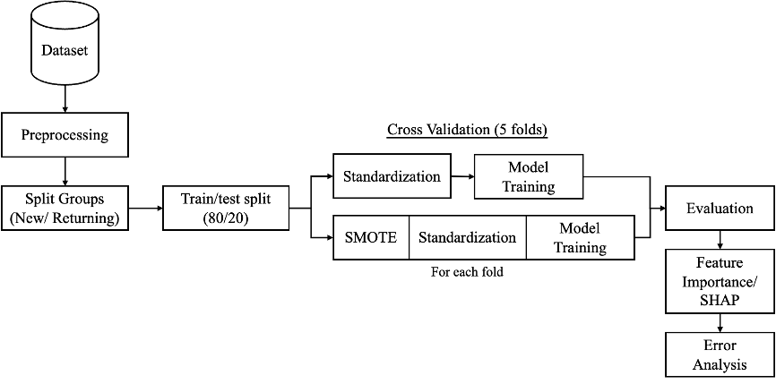
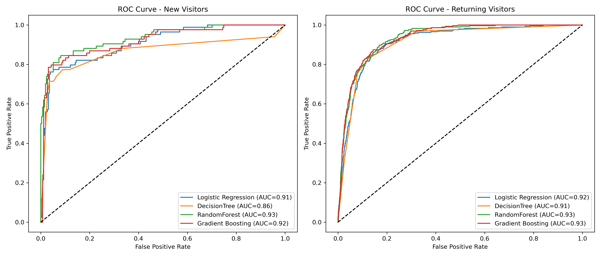

# Predicting Online Shopping Intent: A Comparative Study of New and Returning Visitors with Machine Learning Models

Master's Thesis Project | Tilburg University | MSc Data Science and Society

## Project Overview
This project predicts whether online shoppers will make a purchase based on their browsing behavior and session characteristics.

Unlike most previous studies that analyze all visitors as a single group, this project investigates new visitors and returning visitors separately to better understand behavioral differences and improve prediction performance.

Four machine learning models were evaluated, including Logistic Regression, Decision Tree, Random Forest, and Gradient Boosting. Model interpretability was further explored using SHAP, while SMOTE was applied to address class imbalance.

This project was conducted as part of my MSc thesis in Data Science and Society at Tilburg University.

## Research Questions
1. How do different machine learning models (linear and non-linear) perform in predicting purchase intent for new and returning visitors?

2. Which features have the strongest impact on purchase intent for each group of customers?

3. What is the impact of handling class imbalance with SMOTE on the predictive performance of models for new and returning visitors?

## Key Findings
### Model Performance
1. Random Forest achieved the best performance for new visitors, with an F1-score of 0.817.
2. Gradient Boosting achieved the best performance for returning visitors, with an F1-score of 0.669.
3. Ensemble methods consistently outperformed the baseline model across both visitor types.

### Visitor Behavior Differences
1. PageValues was consistently the most influential predictor.
2. Product-related engagement and seasonal factors were key predictors for new visitors, while administrative and account-related activities played a more important role for returning visitors.

### Impact of SMOTE
Applying SMOTE generally improved model performance, particularly in terms of F1-score. The improvement was particularly significant for returning visitors, where class imbalance was more severe.

## Dataset
**Online Shoppers Purchasing Intention Dataset** 
- Source: [UCI Machine Learning Repository](https://archive.ics.uci.edu/dataset/468/online+shoppers+purchasing+intention+dataset)
- Records: 12,330 user sessions
- Features: 18 numerical and categorical variables
- Target Variable: Revenue (Purchase / No Purchase)
- Customer Segments:
  - New Visitors
  - Returning Visitors

## Technologies Used
Python (Pandas, NumPy, Scikit-learn, Imbalanced-learn (SMOTE), SHAP, Matplotlib)

## Project Workflow
The following workflow summarizes the complete modeling process used in this project.

## Model Performance

### New Visitors
| Model | Accuracy | F1-score |
|---------|---------|---------|
| Logistic Regression | 0.903 | 0.798 |
| Decision Tree | 0.888 | 0.763 |
| Random Forest | **0.912** | **0.817** |
| Gradient Boosting | 0.909 | 0.812 |

### Returning Visitors
| Model | Accuracy | F1-score |
|---------|---------|---------|
| Logistic Regression | 0.852 | 0.616 |
| Decision Tree | 0.867 | 0.636 |
| Random Forest | 0.882 | 0.654 |
| Gradient Boosting | **0.892** | **0.669** |

## ROC Curve Comparison
ROC-AUC was used to evaluate the discriminative ability of each model.

## Repository Structure
- EDA.ipynb – Exploratory Data Analysis
- CV_withSMOTE.ipynb – Cross-validation and hyperparameter tuning with SMOTE
- CV_withoutSMOTE.ipynb – Cross-validation and hyperparameter tuning without SMOTE
- TTS_withSMOTE.ipynb – Model training and testing with SMOTE
- TTS_withoutSMOTE.ipynb – Model training and testing on the original dataset
